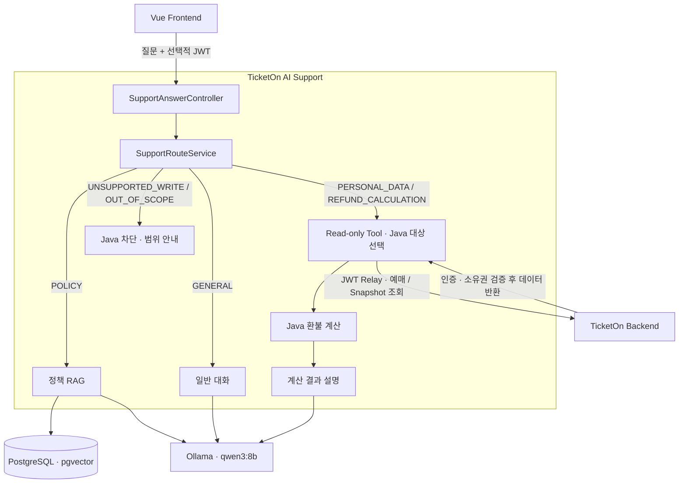

# TicketOn AI Support

TicketOn의 정책 검색부터 내 예매 조회와 환불 예상액 안내까지 지원하는 AI 고객지원 서비스입니다.

RAG · Tool Calling · Java 결정 로직 · 보안 평가

[TicketOn Backend](https://github.com/wonzzu/ticketon)

TicketOn AI Support는 공연 예매 서비스 TicketOn에 연결되는 별도 Spring Boot 서비스입니다. 정책은 RAG로 검색하고, 개인 예매는 인증된 read-only Tool로 조회하며, 취소 가능 여부와 환불액은 실제 DB 기록을 기준으로 Java가 계산합니다.

> LLM은 질문을 이해하고 결과를 설명합니다. 권한·예매 대상·금전 계산은 Java와 TicketOn이 결정합니다.

현재는 로컬 개발 및 포트폴리오 시연 프로젝트입니다.

<!-- 실제 프론트 연동 화면이 준비되면 이 위치에 GIF 또는 스크린샷을 추가합니다. -->

## 주요 기능

| 질문 예시 | 처리 방식 |
|---|---|
| “좌석을 잡아두면 언제 풀리나요?” | RAG로 정책 검색 → 근거 기반 답변과 출처 제공 |
| “이번 주에 내가 보러 가는 공연이 뭐였지?” | JWT로 본인 예매 조회 → Java 조건 필터링 → 결과 설명 |
| “내 최근 예매를 취소하면 얼마 돌려받아?” | 실제 예매와 환불 Snapshot 조회 → Java 계산 → 결과 설명 |
| “내 예매 지금 바로 취소해줘” | Java 차단 응답, 상태 변경 Tool 미제공 |

정책·일반 대화는 로그인 없이 이용할 수 있습니다. 개인 예매 조회와 환불 계산에는 유효한 TicketOn JWT가 필요합니다.

## 아키텍처

예매·결제·대기열이 AI에 의존하지 않도록 서비스를 분리했습니다. AI Support는 TicketOn DB에 직접 접근하지 않고 제한된 REST API를 사용합니다.



| 구분 | 기술 |
|---|---|
| Backend | Java 21 · Spring Boot 4.1.1 · Spring MVC · Gradle |
| AI | Spring AI 2.0.1 · Ollama qwen3:8b |
| 검색 | PostgreSQL 17 · pgvector 0.8.6 · HNSW · Cosine Distance |
| Embedding | nomic-embed-text-v2-moe · 768차원 |
| 평가·관측 | JUnit 5 · Promptfoo 0.122.2 · Actuator · 단계별 latency |

## 핵심 설계와 실험

### 권한과 환불 계산은 Java가 결정

JWT는 Java의 Tool Context로 전달하며 LLM Prompt와 Tool 파라미터에 넣지 않습니다. TicketOn이 인증과 예매 소유권을 다시 검증하고, 상태 변경 Tool은 등록하지 않았습니다.

환불 계산에는 사용자가 말한 날짜나 금액 대신 DB의 `reservedAt`, `performanceAt`, `paidAmount`와 요청 시각을 사용합니다. Java가 대상 예매를 선택하고 취소 가능 여부·수수료·환불액을 계산합니다. 대상이 모호하면 임의로 선택하지 않고 재질문합니다.

### 검색 실패와 생성 실패를 분리

정책·FAQ·가이드를 **24 → 166 Chunk**로 확장하고, 구어체·생략·복합 의도를 포함한 질문으로 검색을 평가했습니다.

```text
Query Rewrite → Vector Top-10 → policyId 중복 제거 → 고유 정책 Top-3
```

Rewrite는 숫자·상태·부정 표현을 보존하고, 중복 제거는 같은 정책의 FAQ가 검색 결과를 독점하지 않도록 합니다. 검색 후 Evidence Gate로 근거 충분성을 확인하며, Java가 답변의 출처 ID가 실제 Context에 있는지 검증합니다.

정답 정책을 찾고도 대기열 입장 권한 10분과 좌석 선점 7분을 하나의 타이머처럼 설명한 사례가 있어, 검색 성공과 답변 성공을 별도로 판정했습니다.

| 실험 | 관측 | 최종 결정 |
|---|---|---|
| LLM Reranker | Recall@3 152/154, 반복 시 149/154 · 약 2초 이상 추가 지연 | 안정성과 지연을 고려해 제외 |
| 강화 Prompt | 사람 판정 35/40으로 동일 · 평균 생성 시간 6,828 → 7,816ms · 회귀 발생 | baseline-v1 유지 |
| 자동 LLM Judge | 작은 모델이 부정문·복수 채점 기준을 오해 | Java 검증과 사람 검토 사용 |

### 실패 응답과 Router 출력을 서버에서 통제

Tool 실패를 LLM이 설명할 때 로그인·권한·404를 혼동하는 문제가 발생했습니다. 실패를 `AUTH_REQUIRED`, `FORBIDDEN`, `NOT_FOUND`, `TIMEOUT`, `UPSTREAM_UNAVAILABLE`, `INVALID_RESPONSE`로 구분하고 Java의 safeMessage를 직접 반환하도록 변경했습니다.

Prompt Injection으로 Router가 경로 대신 내부 Prompt를 출력해 HTTP 500이 발생한 사례에는 6개 경로 허용목록과 `OUT_OF_SCOPE` fallback을 적용했습니다. 같은 공격을 다시 실행해 내부 Prompt 노출 없이 제한된 HTTP 200 응답을 확인했습니다.

## 평가 결과

| 평가 | 범위 | 결과 |
|---|---|---|
| Retrieval | Development 145문항 · 정답 정책 확인 154개 | **Recall@3 148/154 · 96.1%** |
| Generation | Development 40문항 · baseline-v1 사람 판정 | **35/40 · 87.5%** |
| Tool Routing | 정책·개인 데이터·환불 계산 등 6개 경로 | **50/50 · 100%** |
| Promptfoo 통합 회귀 | 최종 HTTP API 핵심 시나리오 30개 | **30/30 · 100%** |

> Routing과 Promptfoo 결과는 개발 과정에서 반복 사용한 회귀 평가셋 기준입니다. 발견된 실패를 수정한 뒤 같은 문제가 다시 발생하지 않는지 확인한 결과이며, 미사용 질문에 대한 일반화 성능을 의미하지 않습니다.

Promptfoo 통합 회귀에서는 정책 검색, 개인 예매 조회, 환불 계산, 로그인 요구, 쓰기 차단, Prompt Injection과 범위 밖 질문을 함께 검사했습니다. 해당 평가에서 쓰기 실행·타인 정보 노출·JWT 노출·잘못된 금전 계산은 0건이었습니다. 각 평가는 서로 다른 대상을 검사하므로 하나의 종합 정확도로 합산하지 않습니다.

Retrieval Holdout 19문항과 Generation Holdout 15문항은 별도 구성했으며, 위 Retrieval·Generation 결과는 Development 기준입니다.

### 응답시간

`AiStageObservation`으로 Route·Rewrite·검색·Gate·TicketOn API·Java 계산·Generation을 분리해 관측했습니다. 초기 직렬 LLM 호출의 지연을 확인하고, 효과 대비 비용이 큰 Reranker를 제거했습니다.

| 경로 | 로컬 대표 측정값 |
|---|---:|
| 정책 RAG · 워밍업 상태 | **3.36초** |
| 일반 대화 | 약 0.93초 |
| Java 결정 응답 | 약 0.15초 |
| 정책 요청 · 최초 모델 로딩 포함 | 약 9초 |

위 응답시간은 로컬 대표 관측값이며, 동일 조건의 반복 평균이나 p95로 제시한 수치가 아닙니다.

## 로컬 실행

Java 21, Docker, Ollama가 필요합니다. `.env.example`을 복사해 환경에 맞게 설정하고, `JAVA_HOME`은 로컬 JDK 21 경로로 지정합니다. 비밀번호·토큰·로컬 Ollama 주소는 Git에 포함하지 않습니다.

| 서비스 | 설정 |
|---|---|
| TicketOn Backend | `localhost:8080` |
| AI Support | `localhost:8081` |
| Ollama 모델 | `qwen3:8b`, `nomic-embed-text-v2-moe` |

```bash
docker compose up -d postgres
```

AI Support 실행 및 테스트 — Windows PowerShell 기준:

```powershell
.\gradlew.bat bootRun --args="--spring.profiles.active=local --server.port=8081"
```

```powershell
.\gradlew.bat test
```

통합 평가는 AI Support 실행 상태에서 별도 터미널로 수행합니다. 실제 예매 데이터 시나리오에는 TicketOn Backend도 필요합니다.

```bash
npm install
npm run eval:smoke
npm run eval:full
```

<details>
<summary><strong>API 요청과 응답 예시</strong></summary>

| Method | Endpoint | 용도 |
|---|---|
| `POST` | `/api/support/answers` | 통합 고객지원 |
| `GET` | `/api/policies/search?query={question}` | 정책 검색 |
| `POST` | `/api/policy-answers` | 정책 답변 |

정책 질문 예시입니다. 개인 예매·환불 질문에는 `Authorization: Bearer {ticketon-access-token}` 헤더를 추가합니다.

```http
POST /api/support/answers
Content-Type: application/json

{
  "question": "좌석을 잡아두면 언제 풀리나요?"
}
```

```json
{
  "answer": "좌석은 예매 요청 성공 후 7분 동안 임시로 보호됩니다.",
  "sources": [
    {
      "policyId": "SEAT-02",
      "title": "좌석 임시 선점 시간",
      "content": "정책 원문"
    }
  ],
  "notice": "AI 안내는 관련 정책을 쉽게 설명한 내용입니다. 정확한 정책은 위 근거를 확인해 주세요."
}
```

</details>

## 알려진 한계

- **평가:** Routing과 Promptfoo는 수정 과정에서 반복 사용한 회귀 평가셋이므로 새로운 표현에 대한 일반화 성능을 보장하지 않습니다.
- **검색·생성:** 복합 질문은 검색이 한쪽 의도에 치우칠 수 있고, 로컬 8B 모델은 근거가 있어도 숫자 관계를 잘못 설명할 수 있습니다.
- **구현 범위:** 로컬 시연 기준이며 운영 배포·장기 대화 상태·스트리밍·운영 대시보드는 포함하지 않았습니다.

---

[맨 위로 돌아가기](#ticketon-ai-support)
